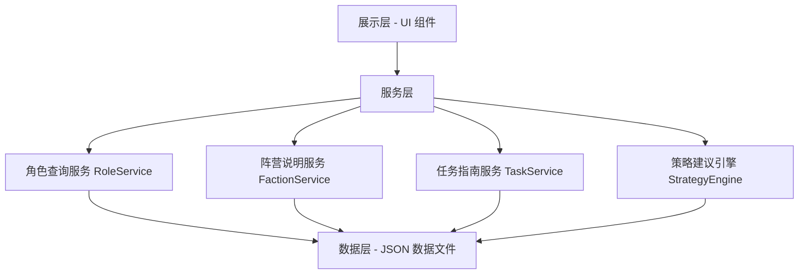

# 技术设计文档：Goose Goose Duck 新手助手工具

## 概述

本设计文档描述了 Goose Goose Duck（鹅鸭杀）新手助手工具的技术架构和实现方案。该工具是一个前端应用，为新手玩家提供角色信息查询、阵营机制说明、任务指南和游戏策略建议四大核心功能。

系统采用纯前端架构，所有游戏数据以静态 JSON 文件形式内嵌于应用中，无需后端服务。核心设计目标是：查询快速、信息准确、易于维护和扩展。

## 架构

### 整体架构

系统采用分层架构，分为数据层、服务层和展示层：



### 技术选型

- **语言**：TypeScript
- **运行环境**：浏览器（纯前端应用）
- **数据存储**：静态 JSON 文件（内嵌于项目中）
- **测试框架**：Vitest + fast-check（属性测试）

### 设计决策

1. **纯前端架构**：游戏数据相对固定，无需后端数据库，降低部署和维护成本
2. **静态 JSON 数据**：便于社区贡献和版本管理，数据更新只需修改 JSON 文件
3. **服务层抽象**：将业务逻辑与 UI 解耦，便于测试和复用
4. **模糊搜索**：角色和任务名称支持模糊匹配，提升用户体验

## 组件与接口

### 1. RoleService（角色查询服务）

负责角色信息的查询、搜索和筛选。

```typescript
interface RoleService {
  // 根据角色名称精确或模糊搜索
  searchByName(query: string): Role[];
  // 按阵营筛选角色列表
  filterByFaction(faction: FactionType): Role[];
  // 获取所有角色
  getAllRoles(): Role[];
  // 获取相似名称的角色推荐
  getSimilarRoles(query: string): Role[];
}
```

### 2. FactionService（阵营说明服务）

负责阵营信息的查询和展示。

```typescript
interface FactionService {
  // 获取所有阵营信息
  getAllFactions(): Faction[];
  // 获取指定阵营的详细信息（含胜利条件、玩法指南、新手建议）
  getFactionDetail(factionType: FactionType): FactionDetail;
}
```

### 3. TaskService（任务指南服务）

负责任务信息的查询和分类。

```typescript
interface TaskService {
  // 根据任务名称搜索
  searchByName(query: string): GameTask[];
  // 按难度等级筛选
  filterByDifficulty(difficulty: DifficultyLevel): GameTask[];
  // 获取所有任务
  getAllTasks(): GameTask[];
}
```

### 4. StrategyEngine（策略建议引擎）

负责根据角色和场景提供策略建议。

```typescript
interface StrategyEngine {
  // 获取指定角色的推荐策略
  getStrategyForRole(roleId: string): RoleStrategy;
  // 获取鹅阵营识别鸭子的技巧
  getGooseDetectionTips(): StrategyTip[];
  // 获取鸭阵营伪装和破坏策略
  getDuckDisguiseTips(): StrategyTip[];
  // 按层级获取策略（新手入门 / 进阶技巧）
  getStrategiesByLevel(level: StrategyLevel): StrategyTip[];
}
```

### 5. SearchUtils（搜索工具模块）

提供通用的模糊搜索和相似度匹配功能。

```typescript
interface SearchUtils {
  // 模糊匹配：返回匹配得分
  fuzzyMatch(query: string, target: string): number;
  // 获取相似项：返回按相似度排序的结果
  findSimilar(query: string, candidates: string[], topN?: number): string[];
}
```

## 数据模型

### 核心类型定义

```typescript
// 阵营类型
type FactionType = 'goose' | 'duck' | 'neutral';

// 难度等级
type DifficultyLevel = 'easy' | 'medium' | 'hard';

// 策略层级
type StrategyLevel = 'beginner' | 'advanced';

// 角色
interface Role {
  id: string;
  name: string;           // 角色名称（中文）
  nameEn: string;         // 角色名称（英文）
  faction: FactionType;   // 所属阵营
  skillDescription: string; // 技能描述
  usageTips: string;      // 使用建议
}

// 阵营详情
interface FactionDetail {
  type: FactionType;
  name: string;              // 阵营名称
  winCondition: string;      // 胜利条件
  playstyleGuide: string;    // 基本玩法指南
  warnings: string[];        // 注意事项
  beginnerTips: string[];    // 新手建议（至少 3 条）
}

// 阵营（简要信息）
interface Faction {
  type: FactionType;
  name: string;
  winCondition: string;
}

// 游戏任务
interface GameTask {
  id: string;
  name: string;              // 任务名称
  difficulty: DifficultyLevel; // 难度等级
  steps: string[];           // 完成步骤
  mapLocation: string;       // 所在地图位置
}

// 角色策略
interface RoleStrategy {
  roleId: string;
  beginnerTips: StrategyTip[];  // 新手入门策略
  advancedTips: StrategyTip[];  // 进阶技巧
}

// 策略建议条目
interface StrategyTip {
  title: string;
  content: string;
  level: StrategyLevel;
}
```

### 数据文件结构

```
data/
├── roles.json          # 所有角色数据
├── factions.json       # 阵营信息数据
├── tasks.json          # 任务指南数据
└── strategies.json     # 策略建议数据
```


## 正确性属性

*属性（Property）是指在系统所有有效执行中都应保持为真的特征或行为——本质上是对系统应做什么的形式化陈述。属性是人类可读规范与机器可验证正确性保证之间的桥梁。*

### Property 1: 角色数据完整性

*对于* 角色信息库中的任意角色，该角色必须包含非空的名称（name）、有效的阵营归属（faction 为 'goose'、'duck' 或 'neutral' 之一）和非空的技能描述（skillDescription）。

**Validates: Requirements 1.1**

### Property 2: 角色搜索返回匹配结果

*对于* 角色信息库中的任意角色，使用该角色的名称进行搜索时，搜索结果应包含该角色，且返回的角色对象应包含阵营（faction）、技能描述（skillDescription）和使用建议（usageTips）字段。

**Validates: Requirements 1.2**

### Property 3: 阵营筛选正确性与完整性

*对于* 任意阵营类型，按该阵营筛选角色时，返回列表中的所有角色都应属于该阵营，且数据库中属于该阵营的所有角色都应出现在返回列表中。

**Validates: Requirements 1.3**

### Property 4: 不存在的角色名称搜索返回空结果并推荐相似角色

*对于* 任意不存在于角色信息库中的搜索字符串，角色搜索应返回空结果，且相似角色推荐列表应为非空（假设数据库非空）。

**Validates: Requirements 1.4**

### Property 5: 阵营详情完整性

*对于* 任意阵营类型，获取阵营详情时应返回包含非空的玩法指南（playstyleGuide）、非空的注意事项列表（warnings），且新手建议列表（beginnerTips）长度至少为 3。

**Validates: Requirements 2.2, 2.3**

### Property 6: 任务数据完整性

*对于* 任务数据库中的任意任务，该任务必须包含非空的名称（name）、非空的完成步骤列表（steps）、非空的地图位置（mapLocation），且难度等级（difficulty）为 'easy'、'medium' 或 'hard' 之一。

**Validates: Requirements 3.1, 3.3**

### Property 7: 任务搜索返回匹配结果

*对于* 任务数据库中的任意任务，使用该任务的名称进行搜索时，搜索结果应包含该任务，且返回的任务对象应包含完成步骤（steps）和地图位置（mapLocation）字段。

**Validates: Requirements 3.2**

### Property 8: 不存在的任务名称搜索返回空结果

*对于* 任意不存在于任务数据库中的搜索字符串，任务搜索应返回空结果。

**Validates: Requirements 3.4**

### Property 9: 角色策略完整性与层级分类

*对于* 角色信息库中的任意角色，获取该角色的策略建议时应返回非空的策略列表，且每条策略的层级（level）应为 'beginner' 或 'advanced' 之一。

**Validates: Requirements 4.1, 4.4**

## 错误处理

### 搜索错误处理

| 场景 | 处理方式 |
|------|---------|
| 角色名称不存在 | 返回空搜索结果 + 调用 `getSimilarRoles` 推荐相似角色 |
| 任务名称不存在 | 返回空搜索结果 + 显示"未找到该任务"提示 |
| 搜索输入为空字符串 | 返回所有项目（等同于无筛选） |
| 搜索输入包含特殊字符 | 对输入进行转义处理后正常搜索 |

### 数据错误处理

| 场景 | 处理方式 |
|------|---------|
| JSON 数据文件加载失败 | 显示友好的错误提示，建议刷新页面 |
| 数据格式不符合预期 | 在应用启动时进行数据校验，记录错误日志 |
| 阵营类型无效 | 使用 TypeScript 类型系统在编译期防止，运行时返回空结果 |

## 测试策略

### 双重测试方法

本项目采用单元测试与属性测试相结合的方式，确保全面覆盖。

#### 单元测试（Vitest）

单元测试用于验证具体示例、边界情况和错误条件：

- **示例测试**：验证三个阵营（鹅、鸭、中立）的胜利条件数据存在（需求 2.1）
- **示例测试**：验证鹅阵营识别鸭子技巧数据非空（需求 4.2）
- **示例测试**：验证鸭阵营伪装和破坏策略数据非空（需求 4.3）
- **边界测试**：空字符串搜索行为
- **边界测试**：特殊字符输入处理
- **集成测试**：各服务模块之间的协作

#### 属性测试（fast-check）

属性测试用于验证在所有有效输入下都成立的通用属性：

- 每个属性测试对应设计文档中的一个正确性属性
- 每个属性测试至少运行 100 次迭代
- 每个正确性属性由一个属性测试实现
- 每个测试用注释标注对应的设计属性，格式为：**Feature: goose-goose-duck-helper, Property {number}: {property_text}**

#### 属性测试库

- 使用 **fast-check** 作为 TypeScript 属性测试库
- 不从零实现属性测试框架
- 配置每个测试至少 100 次迭代（`fc.assert(property, { numRuns: 100 })`）

#### 测试文件结构

```
tests/
├── unit/
│   ├── roleService.test.ts
│   ├── factionService.test.ts
│   ├── taskService.test.ts
│   └── strategyEngine.test.ts
└── property/
    ├── roleService.property.test.ts
    ├── factionService.property.test.ts
    ├── taskService.property.test.ts
    └── strategyEngine.property.test.ts
```
